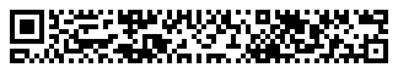

# QRRRRRRRR
**Description:** Wait a second, they made QR codes longer!?!
    

## Solution

1. My first instinct was to google 'Long horizontal QR code', eventually I came across this site `https://www.qrcode.com/en/codes/rmqr.html` and learned it was a rMQR qr code.

1. After a little more looking into rMQR I stubbled upon a neat [Youtube video](https://www.youtube.com/watch?v=J8S-NJ1GTn4) by John Hammond (helps run Nahamcon) so I figured this would help. Surely enough, he directed viewers they could scan these qr codes using the [qrqr app](https://apps.apple.com/us/app/qrqr-qr-code-reader/id911719423) available in the app store.

1. I downloaded the qrqr app, scanned the qr code and found the flag.

