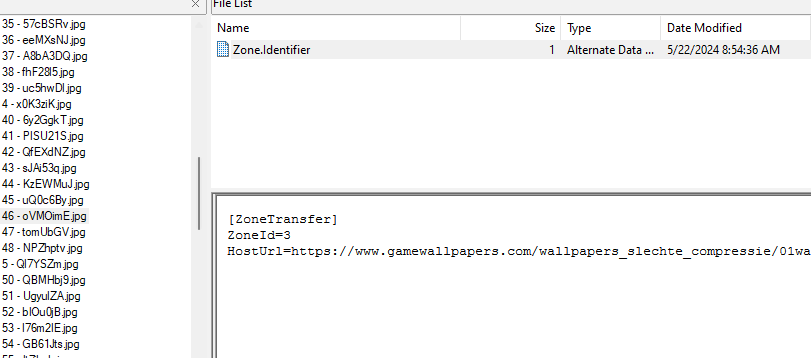

# Breath of the Wild
**Description:** I got a sweet desktop background for my favorite video game, but now I want more! Problem is, I forget where I downloaded it from... can you help me remember where I got this old one?

## Solution

1. First I had to identify what kind of file it was. One way of doing that is using `file` in linux but I was in my Windows machines so I opened a hex editor (HxD) and viewed the signature.
    
    This signature had `vhdxfile` so i added vhdx to the file name (because windows is lame and needs extensions)

2. Now I can mount the drive and unecrypt it with the supplied password (videogames). 
    
    For this part I simply just double clicked it and mounted it. Real world this probably isn't the best approach *especially* on a personal machine lol but bare with me here

3. Next, with it mounted, I knew I needed some forensic tool because they wanted to know where they downloaded it so I opened up FTK Imager and added that mounted drive to evidence.
    
    Open FTK Imager -> Add Evidence -> Add logical drive and select volume to which it was mounted to

    I probably could have used something like Autopsy too but takes longer to process and run its scripts

4. There are about 90 images so I just manually clicked each one in FTK Imager and checked the Zone.Identifier to see the url where the file was downloaded.

    Eventually I found `46 - oVMOimE.jpg` which had a stange url of `https://www.gamewallpapers.com/wallpapers_slechte_compressie/01wallpapers/&#102;&%23108;&%2397;&%23103;&%23123;&%2356;&%2351;&%23102;&%2350;&%2398;&%2348;&%2397;&%2356;&%2399;&%23101;&%2351;&%2357;&%23102;&%2350;&%23101;&%2353;&%2398;&%2397;&%2349;&%23100;&%2354;&%2399;&%2355;&%2348;&%23101;&%2357;&%2355;&%23102;&%2350;&%2357;&%2349;&%23101;&%23125;`

    

5. I copied this url over to CyberChef to do some decoding.

    It appeared to me that it was url decoded so I added that filter and got this 

    `&#102;&#108;&#97;&#103;&#123;&#56;&#51;&#102;&#50;&#98;&#48;&#97;&#56;&#99;&#101;&#51;&#57;&#102;&#50;&#101;&#53;&#98;&#97;&#49;&#100;&#54;&#99;&#55;&#48;&#101;&#57;&#55;&#102;&#50;&#57;&#49;&#101;&#125;`
    
    At this point I really wasn't sure where to go, the `&` and `;` were really throwing me off. So, I did what anyone would do, asked **chatgpt**. 

6. gpt told me it was HTML entities and it immediately clicked. I added that filter on CyberChef and got my flag.

