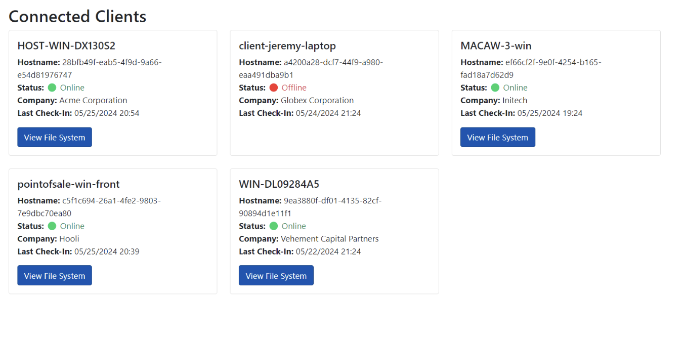

# HelpfulDesk 
**Description:** HelpfulDesk is the go-to solution for small and medium businesses who need remote monitoring and management. Last night, HelpfulDesk released a security bulletin urging everyone to patch to the latest patch level. They were scarce on the details, but I bet that can't be good...

## Solution
1. On the website I was able to find files I could download with different versions of the application. I also took note that this website was runnning on version 1.1 (this is important).

1. From the security bulletin I saw that version 2.0 was 'patched' but since we are on version 1.1 I wanted to see if I could find what was patched to potentially remotely execute code or login to admin portal. So, I tried to use the diff command to help me.
	```
	diff -qr source1.1 source2.0
	```
	this returned that HelpfulDesk.dll are different, I knew to look there

1. I opened ilspy to decompile the dll files (from version 1.1 and version 2.0) and ran through the code to compare them side by side. P.S. could also use a neat tool like snyk here.

1. During the code analysis I noticed in SetupController in HelpfulDesk.Controller that the IActionResult function changed from v1.1 to v2.0
	
	v1.1
	``` 
		public IActionResult SetupWizard()
		{
			if (System.IO.File.Exists(_credsFilePath))
			{
				string requestPath = base.HttpContext.Request.Path.Value;
				if (requestPath.Equals("/Setup/SetupWizard", StringComparison.OrdinalIgnoreCase))
				{
					return View("Error", new ErrorViewModel
					{
						RequestId = "Server already set up.",
						ExceptionMessage = "Server already set up.",
						StatusCode = 403
					});
				}
			}
			return View();
		}
	```

	v2.0
	```
		public IActionResult SetupWizard()
		{
			if (System.IO.File.Exists(_credsFilePath))
			{
				string requestPath = base.HttpContext.Request.Path.Value.TrimEnd('/');
				if (requestPath.Equals("/Setup/SetupWizard", StringComparison.OrdinalIgnoreCase))
				{
					return View("Error", new ErrorViewModel
					{
						RequestId = "Server already set up.",
						ExceptionMessage = "Server already set up.",
						StatusCode = 403
					});
				}
			}
			return View();
		}
	```

	in v2.0 it added `.TrimEnd('/')`

	but in version 1.1 (what currently is running in the web instance) is vulnerable to path traversal since we can simply append a leading slash `/` to enter the SetupWizard

	accessed `https://xx/setup/setupwizard/` instead of `https://xx/setup/setupwizard` whiched allowed me to set admin login (I did admin:admin)

	

5. I can now go bask login as administrator from homepage

	

6. In adminstrator pannel I accessed HOST-WIN-DX130S2 and downloaded flag

