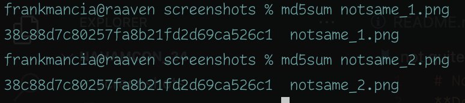

# Not Quite the Same
**Description:** Everyone knows MD5 hashes. Everyone knows .png files! I believe you'll collide with greatness.

## Solution

1. This site is asking for two different png images that return the same md5 hash. So the images must be different but the md5 has **must** be the same

2. After some googling around, I found a github by corkami that explains how this can be performed with some minor file changes thanks to the flaws of md5.

3. His github also had [two png](https://github.com/corkami/collisions/tree/master/examples) examples which I uploaded to this challenge to get the flag.

    The first image is 

    

    The second image is 

    

    both with the same hash!

    

