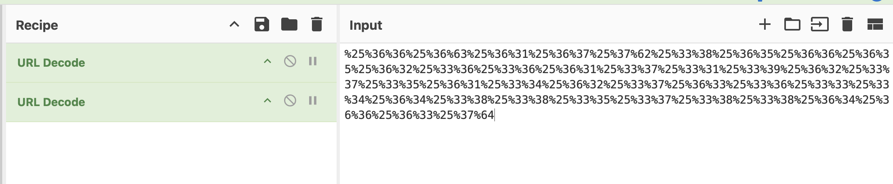

# Uriel 
**Description:** Uriel was browsing the web and he saw this big long blob of text in his address bar! He was telling me about it but I don't remember everything he said... I think he mentioned something like "it happened twice?"

    %25%36%36%25%36%63%25%36%31%25%36%37%25%37%62%25%33%38%25%36%35%25%36%36%25%36%35%25%36%32%25%33%36%25%33%36%25%36%31%25%33%37%25%33%31%25%33%39%25%36%32%25%33%37%25%33%35%25%36%31%25%33%34%25%36%32%25%33%37%25%36%33%25%33%36%25%33%33%25%33%34%25%36%34%25%33%38%25%33%38%25%33%35%25%33%37%25%33%38%25%33%38%25%36%34%25%36%36%25%36%33%25%37%64

## Solution

1. As per usual, I see some encoded string, I run to CyberChef

1. I find two things interesting in the description.
    1. 'text in his address bar'
    1. 'it happened twice'

    This tells me this encoded string is most liked URL Encoded TWICE

1. In CyberChef I add `URL Decode` twice to the recipe and get my flag.

    

